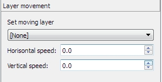

# Events
## Overview
**Events** - there are automatic actions that allow you to dynamically control the game process and make dynamic changes of level, game, or settings of objects. They can be automatically started by special actions called triggers.

To add a new event to the list, simply press the "+" button. To remove - "-". You can duplicate the current layer by clicking to "Create a copy of the event" button.

The event will start automatically on level start if you check an "**Autostart**" checkbox.

There are some built-in events that you can't remove:
- "**Level - start**" - starts automatically on level start-up. You can use it to set an initial visibly of layers, show greeting message, start moving of spike wall, etc.
- "**P Switch - Start**" - starts if you will activate the special item called "P-Switch". You can make, for example, a showing of layers with a surprise for your playable character.
- "**P Switch - stop**" - This event starts if the P-Switch timer was the end. This event can be used, for example, to hide the same layer with a surprise.

> **Tip:** You can drag event items in a list to change their order

> **Tip:** You can rename an event by double-click on the layer name. The new name of the event will be applied to all items which using them without loss of connections.

_Events toolbox_

* [Layer visibility](#layer-visibility)
* [Layer motion](#layer-motion)
* [Auto-scroll sections](#auto-scroll-sections)
* [Change section settings](#change-section-settings)
* [Common event actions](#common-actions)
* [Force player controls](#force-player-controls)
* [Trigger another event](#trigger-another-event)

## Layer visibility
There are lists of layers are used to perform specific action at the title of the list.
I.e. change the visibility of all member items of layers added into the list. 

To add a layer into the list, please, select it in the general list shown at the top of
the tab, and press "+" button at the desired list to add.

To remove a layer from the list, select the layer in the list from which you want to remove it, and then, press the "-" button.

!> **Note:** Levels saved in the SMBX64 LVL format has a limitation of 20 items per every list. If you add more and save your level as SMBX64 LVL format, all items out of 20 limit will be removed. Level files of PGE-X (LVLX) and SMBX-38A formats don't have this limit. 

_Layer visibly tab_

## Layer motion
Here you can configure the movement for solid and statical items that are members of a target layer.

Layer that is selected in a list will be moved with a specified speed in the next directions:

**Horizontal speed**:
- If <0 - move to left.
- If >0 - move to the right
- If =0 - stop

**Vertical speed**:
- If <0 - move up
- If >0 - move to down
- If =0 - stop

_Layer move list_

## Auto-scroll sections
Here you can define auto-scrolling of the target section.

!> **Notes!** Please read them carefully, they are very important!
* Don't forget to specify the target section size in the section properties of the same event. If you didn't specify the section, Auto-scroll will not work.
* If you want to use auto-scrolling in the legacy SMBX engine, be extremely careful, the logic in the legacy engine is buggy and requires extremely: you can only make an auto-scrolling section that matches by the index of the event itself in the list. I.e. If you use the "Level - Start" event to trigger the auto-scrolling, you can only use the Section 0 (1 in the original SMBX Editor) to run the auto-scrolling. Or, you can use the section 3 (4 in the original) if you make a custom event that appears in the list next after "P-Switch - End".

**Horizontal speed**:
- If <0 - move to left.
- If >0 - move to the right
- If =0 - stop

**Vertical speed**:
- If <0 - move up
- If >0 - move to down
- If =0 - stop

_Autoscroll speed setup: legacy and modern_

  

### How to make the auto-scroll of the section (Modern Method)
This method is works in **TheXTech**, **SMBX-38A**, and is supposed to work in the **Moondust Engine** once this behaviour will be fixed.
Unlike legacy method, you can control the auto-scrolling dynamically, trigger it at any time, start, stop, change speed/direction, etc.
And also, you can have the auto-scrolling enabled in multiple different sections!

1) As the first step, you should specify the initial section size which will be used as an auto-scrolled frame.

2) At the same event entry, open the "Section settings" tab and then select them "define new" and set a size of the auto-scrollable part of screen. You can click the "Capture" button to select the size of the scrollable area of the section in the interactive mode: 
   
    There are examples of auto-scrolling areas:
    
3) Find below the "Change the autoscroll speed" setting, enable it, and assign the speed X and speed Y values.
4) Make this event auto-start or assign a trigger to block or to an NPC to trigger the autoscroll.

> **Tip:** You may want to have the "change section size" event being separate from the auto-scroll toggling and so, you can control the auto-scroll speed just dynamically without bothering the section's size. You can have a chain of events that assign the speed and direction of the auto-scroll, so you can have the auto-scroll that changes its route dynamically.

> **Note:** The only "Simple" method is implemented right now, the "Advanced" is not yet done. It's planned that you can make build the auto-scrolling path from vertexes and curves using this way.

If you did everything correctly, the screen will start its scrolling when you launch the test of this level, or when you cause an even trigger to start the auto-scrolling at the desired section.

### How to make the auto-scroll of the section (Legacy Method)
This method is used to configure the auto-scrolling that will work in the **original legacy SMBX engine**. To use this method, you are required to use the "Autoscroll Section (Legacy)" tab.

1) As the first step, you should specify the initial section size which will be used as an auto-scrolled frame.

2) At the same event entry, open the "Section settings" tab and then select them "define new" and set a size of the auto-scrollable part of screen. You can click the "Capture" button to select the size of the scrollable area of the section in the interactive mode: 
   
    There are examples of auto-scrolling areas:
    

3) Set the number of a section that will be auto-scrolled and the speed X and speed Y values. In the legacy SMBX engine and at the TheXTech using legacy method, the section number should match the index of the event itself (a 0-based order in the list of events).

!> **Important:** Don't forget to mark this event as "auto start"!

If you did everything correctly, the screen will start its scrolling when you launch the test of this level.

## Change section settings
Here you can set options for each section of this level. You can define: music, background, and size/position of the selected section.

Inside one event, you can define options for slightly sections one event. Also, you can restore the default settings of the target section, defined by section settings.

**Set settings for section...** - select the slot of settings for each section. You can define in one event changes for multiple sections, in SMBX are available by the engine, but too difficult for made by SMBX editor. Here this is fully available.

**Set size and position** - This option can dynamically redefine the section size and reset the size to default.

**Change music** - This option can change the music of the selected section, or switch to section default.

**Change background** - This option can change the background of the selected section.

**Change the autoscroll speed** - This option allows to specify the speed and direction of the camera autoscroll on this section using modern method. See the manual above on how to build auto-scrolled sections. 

_Capturing of new size what will be defined by event_

## Common actions
Here you can:
- Display message box
- Play sound from the list
- Start the end of a game algorithm: Play end of game fanfares -> show credits screen -> save game, return to the main menu

_Message box editing_

## Force player controls
Here you can control a playable character to automate its actions.

## Trigger another event
This feature allows the execution of another event after running this. You also can specify a delay before executing the target event.

