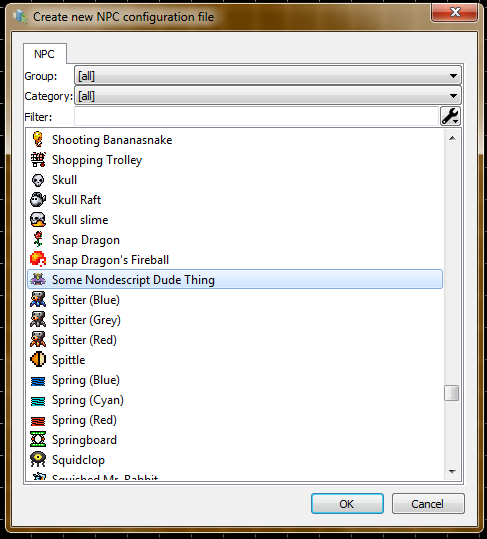

# NPC.txt Editor features
The Editor have own powerful NPC editor which can emulate the NPC in a real time which helps you with configuring and debugging process.

Each NPC config basing on the global configuration and using for customize already configured NPC.

* **Selecting "New" NPC Config**

  

* **Selecting NPC base for your config**

  

* **NPC Editor workspace**

  
