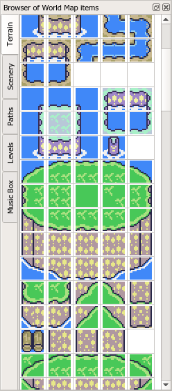
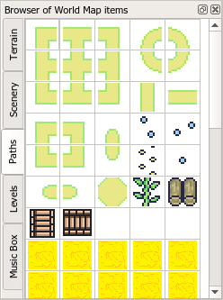
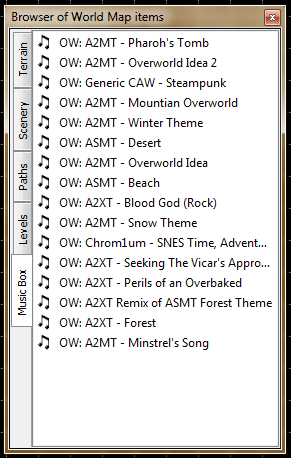

# Search Browser

**Search browser** - The toolbox that contains a list of available items to add to the current level section or the world map.

Click a necessary object in the list to pick it up for adding to the level or world map.

Unlike the Search Browser at the Level Editor, the Search Browser at the World Editor has no filtering.

> **Tip:** You can play music through the music boxes list when you click any music list item. If the music player is enabled, the music playing will be started once you will select it from the item box.

