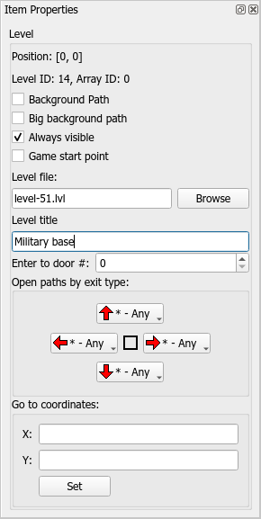

# Items
## Overview
Main content and part of any world maps. There are construction materials, sceneries, level entrances, paths, etc.
## Terrain tiles
The main design units are used for the creation of the terrain design of the world map. Terrain tiles are not communicating with other elements, there are always static. (except water terrain tiles)

## Sceneries
The second design unit. Sceneries are can be hidden when the player had to open the path that goes through them.

## Paths
Allow a player to move between level points and map locations. Usually, paths are hidden and appearing when players pass the level which is placed nearly to them.

## Level entrances
There are special units, which are allowing you to enter into a defined level or teleport player to other map coordinates. Levels can have multiple entrances but can have different warp points inside a level. Also, level point using as the game start point. If the point is not defined, the player will start from 0x0 coordinates.

### Level Entrance Properties

**Position** - Displaying currently coordinated with the selected item.

**Level ID** - ID of a level item defined in the global configuration.

**Array ID** - the connection nodes of the selected item.

**Background path** - under level point image will be displayed path image

**Big Background path** - under level point image will be displayed same path image, but with the larger size

**Always visible** - with this option the level point will be displayed always. If this flag is disabled, the level point will be shown only when the player opens a path to them.

**Game start point** - the important option needed for the definition of the player's initial position on the game begins. This point must exist on the world map if you're creating the world map based episode (if you're creating a hub-based episode, this point is not needed).

**Level file** - defining the target level file.

**Level Title** - This is a level title that will be displayed in the game process when the player stands over this level item.

**Enter to door #** - defining the warp Array ID, where the player will be entered after start level. If the value is 0, the player starts level from its default start point.

**Open paths by exits** - defining the condition for open path per each side of level point.

**Goto coordinates** - If these values are set, this point will teleport the playable character to a defined location. Also, you can select a target point in the interactive mode when you press the "Set" button.

## Music Boxes
There are special units that are switching playing music when the player character stands on them.

